<p align="center">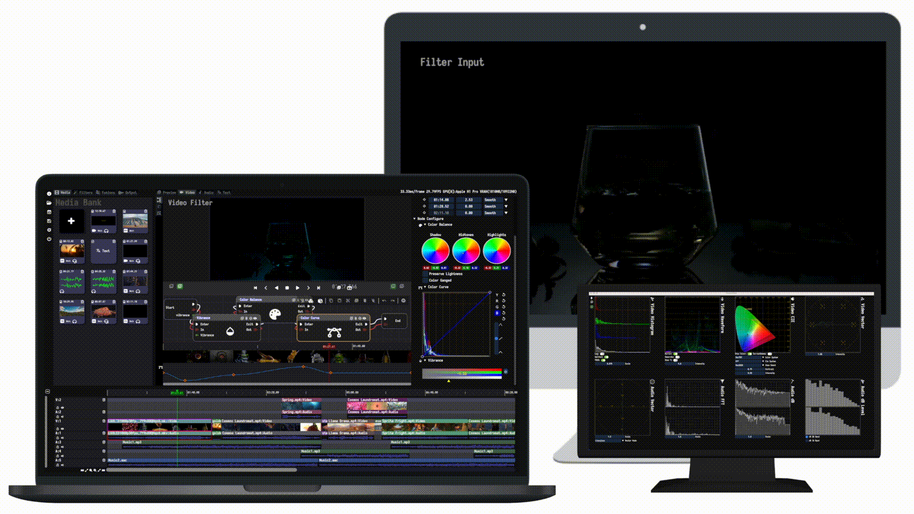</p>

<h1 align="center">MediaEditor Community</h1>

<div align="center">
  A simple and elegant open-source media editor that focused on convenience and usability.<br>
  <sub>Available for Linux, macOS and Windows.</sub>
</div>
<br>

<div align="center">
  <a href="LICENSE"></a>
  <a href="https://github.com/opencodewin/MediaEditor/wiki"></a>
  <a href="https://github.com/opencodewin/MediaEditor/pulls"></a>
  <a href="#HOW-TO-CONTRIBUTE"></a>
  <a href="https://github.com/opencodewin/MediaEditor/commits/master"></a>
</div>

<br>

<h2 align="center">⭐️ Welcome to MediaEditor Community Software! ⭐️</h2>

MediaEditor Community(MEC) is a highly integrated and easy to learn application software that can be used to **create, edit, and produce** high-quality videos. The functions involve **video editing, video filters, video transition, audio mixing, and text processing**.🌼

## News
### **⭐️⭐️⭐️ - 2023/05/19 [v0.9.7](https://github.com/opencodewin/MediaEditor/releases/tag/v0.9.7) is release.**
  - 🔥 Supported plugin, which can expand filters, transitions, effects and AI, according to your own needs.
  - 💡 More effect and transition node.
  - 💡 More convenient way of UI operations.
  - 💡 Some known bugs fixed and optimizations of core features.

⭐️⭐️⭐️ - 2023/04/20 MediaEditor Community first release v0.9.6 is now available; you can download binary-packages from [here](https://github.com/opencodewin/MediaEditor/releases/tag/v0.9.6).

## FEATURES
* Support complete timeline editing functions, including move, crop, cut, thumbnail preview, scale and delete.
  &emsp;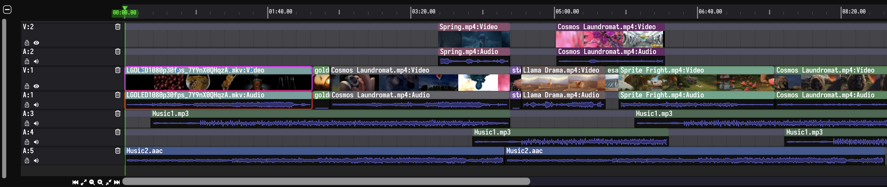
* Support more flexible and easily blueprint system. Blueprint💫 is represented in the form of nodes, which can handle complex functions through nodes and flows.
  &emsp;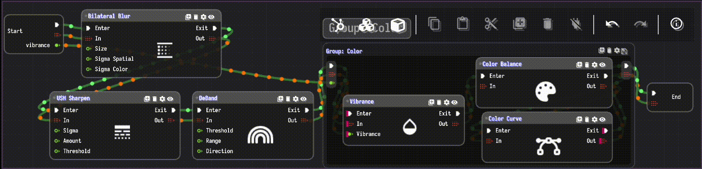
* Support about 45+ built-in media filters and 70+ built-in media transitions🤖.

  &emsp;
* Support about 10 video and audio analysis tools🍂.

  &emsp;🍂Video CIE&emsp;&emsp;&emsp;&emsp;&emsp;&emsp;&emsp;🍂Video Waveform&emsp;&emsp;&emsp;&emsp;🍂Audio Spectrogram

  &emsp;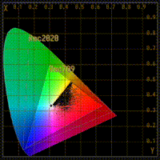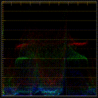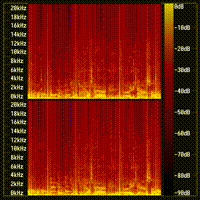

* A lightweight, cross platform, high-performance software, support Linux, Mac, and Windows.
* Support multiple audio and video codecs, including ProRes, H.264, H.265, VP9, etc.
* Support import and edit videos from standard definition to 4K resolution.
* Support magnetic snapping, which can smoothly adjust adjacent clips when arranging them to eliminate gaps, conflicts, and synchronization issues.
* Support frame-by-frame preview mode, including forward playback and reverse playback.
* Support multi-monitor mode, making it easy to preview and process media through external monitors.
* Support video attribute-editing, including cropping, moving, scaling and rotating video frames.
* Support audio mixing, including mixer, pan, equalizer, gate, limiter and compressor.
* Support curve and keypoint, applied in video filter, video transition, audio filter, audio transition, video attribute and text subtitle.
* Support subtitle editing, including font, position, scale, rotate, oytline width, font attribute, alignment, etc.
* Support customized blueprint nodes, allowing for free expansion of filter and transition effects.
* Support multiple professional export formats, including QuickTime, MKV, MP4, Matroska, etc.

## GETTING STARTED
MEC support as many operating systems as possible and provide release packages for those platforms. To get started, head over to the **[releases page💠](https://github.com/opencodewin/MediaEditor/releases)** and select the platform that you want to install it on. A **[quick guide📝](docs/dev/Quick-Start.md)** to help you get acquainted with MEC is available in our docs.

There are two things to note:

- ⚠️⚠️⚠️ Vulkan sdk is necessary, please download and install it [here](https://vulkan.lunarg.com/sdk/home).
- ⚠️⚠️⚠️ For linux, please make the AppImage file executable by the following command:
``` sh
chmod +x MEC_SDL2_OpenGL3-linux-x86_64-x.x.x.AppImage
``` 
And if you're using linux distros that use fuse3, and miss libfuse.so.2 to run the AppImage file, you can install it by:
``` sh
sudo apt install libfuse2
```

## SCREENSHOT
|<div>Video Filter</div>|<div>Video Transition</div>|
|---|---|
|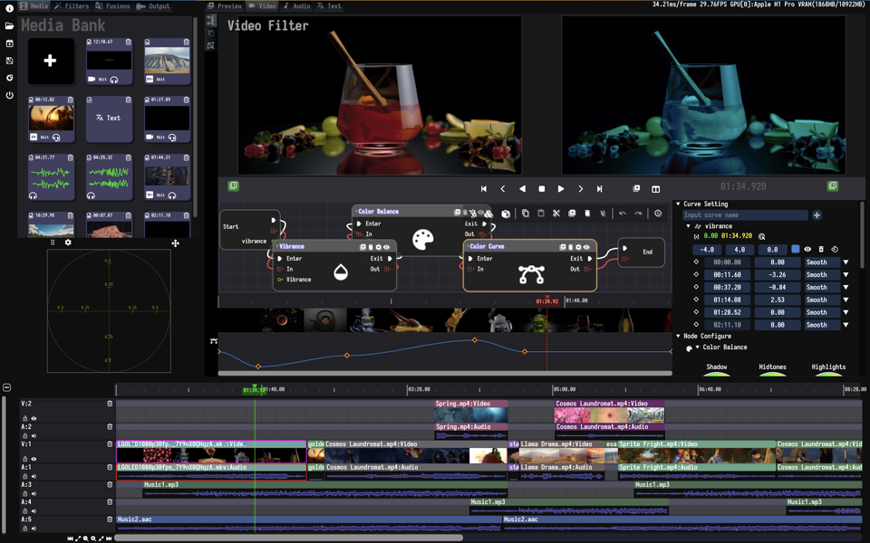|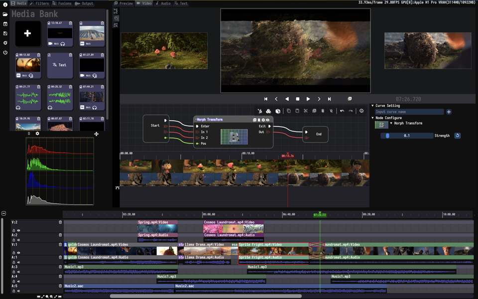|

|<div>Audio Mixing</div>|<div>Media Output</div>|
|---|---|
|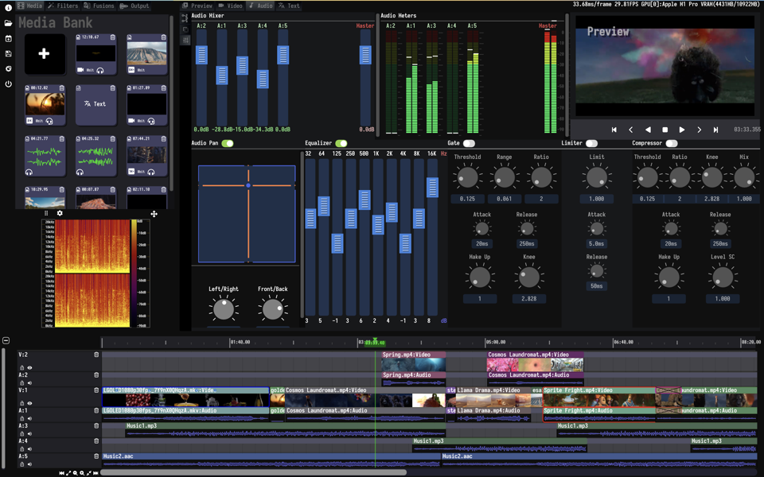|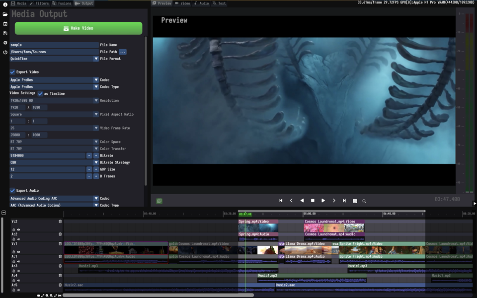|

## FILTERS
| | | | | |
|------------------|-----------------|:--------------|:----------------|:---------------|
| ALM Enhancement  | Audio Equalizer | Audio Gain    | Bilateral Blur  | Binary         |
| Box Blur         | Brightness      | Canny Edge    | CAS Sharpen     | Chroma Key     |
| Color Balance    | **Color Curve** | Color Invert  | Contrast        | Crop           |
| Deband           | Deinterlace     | Dilation      | Erosion         | Exposure       |
| Flip             | Gamma           | Gaussian Blur | Guided Filter   | HQDN3D Denoise |
| Hue              | Laplacian Edge  | Lut 3D        | SmartDenoise    | Sobel Edge     |
| USM Sharpen      | Vibrance        | WarpAffine    | WarpPerspective | White Balance  |
| BarrelDistortion | Distortion      | Jitter        | Kuwahara        | Lighting       |
| PixeLate         | RadicalBlur     | SmudgeBlur    | Soul            | Star           |
| Sway             | WaterRipple     | | | |
| | | | | |

**Color Curve**

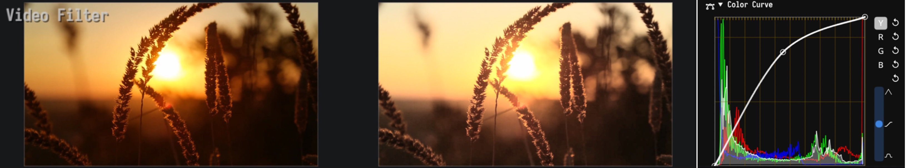

## TRANSITIONS
| | | | | |
|-----------------|----------------|:-----------------|:-----------------|:------------------|
| Alpha           | AudioFade      | LinearBlur       | BookFlip         | Bounce            |
| BowTie          | Burn           | BurnOut          | ButterflyWave    | CannabisLeaf      |
| CircleBlur      | CircleCrop     | ColorPhase       | ColorDistance    | CrazyParametric   |
| Crosshatch      | CrossWarp      | CrossZoom        | **Cube**         | DirectionalScaled |
| DirectionalWarp | Dissolve       | DoomScreen       | Door             | Doorway           |
| Dreamy          | DreamyZoom     | Edge             | Fade             | Flyeye            |
| GlitchDisplace  | GlitchMemories | GridFlip         | **Heart**        | Hexagonalize      |
| KaleidoScope    | Luma           | LuminanceMelt    | Morph            | Mosaic            |
| Move            | MultiplyBlend  | PageCurl         | Perlin           | Pinwheel          |
| Pixelize        | Polar          | PolkaDots        | Radial           | RandomSquares     |
| Rectangle       | Ripple         | Rolls            | RotateScale      | RotateScaleVanish |
| SimpleZoom      | SimpleZoomOut  | Slider           | SquaresWire      | Squeeze           |
| StaticWipe      | StereoViewer   | Swap             | Swirl            | WaterDrop         |
| Wind            | WindowBlinds   | WindowSlice      | Wipe             | ZoomInCircles     |
| | | | | |

**Cube**


**Heart**

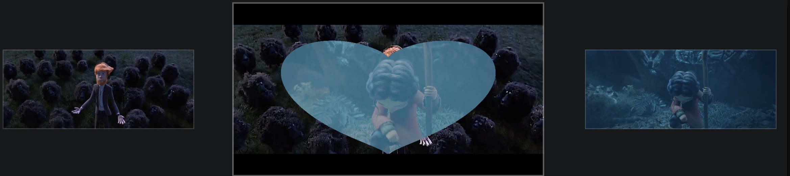

## DEPENDENCIES
Although installers are much easier to use, if you must build from 
source, here are some tips: 

MEC needs some relevant submodules to be compiled to run. So, 
be sure you have the following submodules in order to run MEC successfully: 

*  imgui (https://github.com/opencodewin/imgui.git)
*  blueprintsdk (https://github.com/opencodewin/blueprintsdk.git)
*  mediacore (https://github.com/opencodewin/MediaCore.git)

## HOW TO BUILD
MEC uses CMake as its building system but instructions are highly dependent on your operating system and target platform. **[Building from source🐙](docs/dev/How-to-Built.md)**.

## HOW TO CONTRIBUTE
MEC is created by users for users and **we welcome every contribution**. There are no highly paid developers or poorly paid support personnel on the phones ready to take your call. There are only users who have seen a problem and done their best to fix it. This means MEC will always need the contributions of users like you.

## LICENSE
MEC is **[LGPLv3 licensed](LICENSE)**. You may use, distribute and copy it under the license terms.

<a href="https://github.com/opencodewin/MediaEditor/graphs/contributors"></a>
