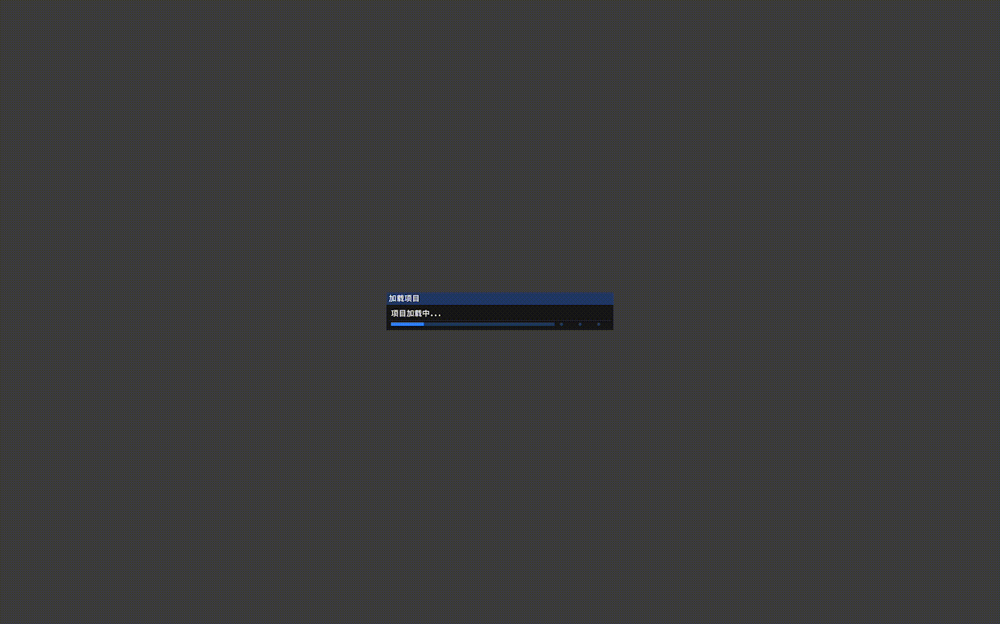

  <strong>
    <a href="https://www.code-win.com">website</a>
    •
    <a href="https://www.code-win.com/docs">docs</a>
    •
    <a href="https://www.code-win.com/community">community</a>
    •
    <a href="https://www.code-win.com/addons">add-ons</a>
  </strong>

  
  
  
  
  

<h1 align="center">
  Welcome to Media Editor Custom Software!
</h1>

MEC is a **free and open source** software for media editing. Available as a native application for **Linux, macOS and Windows operating systems**, MEC runs on most common processor architectures.

## Features
* Cross-platform (Linux, Mac, and Windows)
* Support for many video, audio, and image formats (based on FFmpeg)
* Powerful curve-based Key frame animations
* Desktop integration (drag and drop support)
* Unlimited tracks / layers
* Clip resizing, scaling, trimming, snapping, rotation, and cutting
* Video transitions with real-time previews
* Compositing, image overlays, watermarks
* Title templates, title creation, sub-titles
* Advanced Timeline (including Drag & drop, scrolling, panning, zooming, and snapping)
* Frame accuracy (step through each frame of video)
* Time-mapping and speed changes on clips (slow/fast, forward/backward, etc...)
* Audio mixing and editing
* Digital video effects, including brightness, gamma, hue, greyscale, chroma key, and many more!
* Render videos in many codecs and formats (based on FFmpeg)

## Getting Started
MEC's developers work hard to make it support a large range of devices and operating systems. We provide final as well as development builds. To get started, head over to the **[downloads section](https://www.code-win.com/download)** and simply select the platform that you want to install it on. A **[quick start guide](https://www.code-win.com/docs)** to help you get acquainted with MEC is available in our docs.

## How to Contribute
MEC is created by users for users and **we welcome every contribution**. There are no highly paid developers or poorly paid support personnel on the phones ready to take your call. There are only users who have seen a problem and done their best to fix it. This means MEC will always need the contributions of users like you.

## Dependencies
Although installers are much easier to use, if you must build from 
source, here are some tips: 

MEC needs some relevant submodules to be compiled to run. So, 
be sure you have the following submodules in order to run MEC successfully: 

*  imgui (https://github.com/opencodewin/imgui.git)
*  blueprintsdk (https://github.com/opencodewin/blueprintsdk.git)
*  mediacore (https://github.com/opencodewin/MediaCore.git)

## Building
MEC uses CMake as its building system but instructions are highly dependent on your operating system and target platform. Fortunately **[we've got you covered](docs/How-to-Build.md)**.

## License
MEC is **[GPLv2 licensed](LICENSE)**. You may use, distribute and copy it under the license terms.

