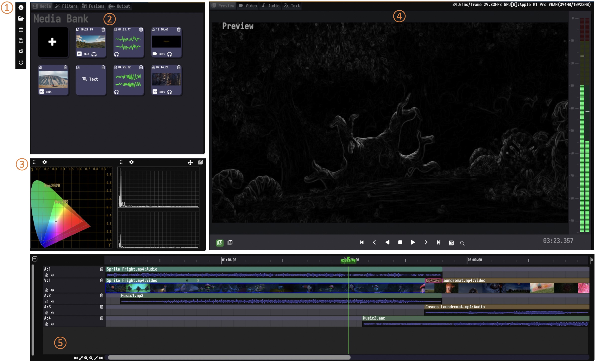

<h1 align="center">
  

  
  
  
  
  

  Welcome to Media Editor Community Software!
</h1>

Media Editor Community(MEC) is a **free and open source** software for media editing. Available as a native application for **Linux, macOS and Windows operating systems**, MEC runs on most common processor architectures.

## MEC GUI COMPONENTS
① System Sidebar &emsp;&emsp;&emsp;&emsp;&emsp;&emsp;&emsp;&emsp;&emsp;&emsp;&emsp;&emsp;&emsp;&emsp;&emsp;&emsp;&emsp;&emsp; ④ Media Preview/Video/Audio/Text Editor

② Media Bank/Filter Bank/Fusion Bank/Media Output &emsp;&emsp; ⑤ Timeline

③ Clip Analysis Tools

  

## MEC IS ALL YOUR NEED

|
Video Filter
|
Video Fusion
|
|---|---|
|||

|
Audio Mixing
|
Media Output
|
|---|---|
|||

## FEATURES
**Adapt to various types of content:**
* Import and edit videos from standard definition to 4K resolution
* Support multiple major media formats
* Support multi-display playback and viewing of high-definition media

**More efficient editing:**
* Support magnetic snapping, which can smoothly adjust adjacent clips when arranging them to eliminate gaps, conflicts, and synchronization issues.
* Support frame-by-frame preview, combined with convenient cropping tools, to fine-tune your cropping at the frame level.
* Support clip groups to manage and move clips.

**Diversified special effects and transition effects:**
* Support about 30 built-in video special effects, including video enhancement, edge detection, matte extraction, picture smoothing, and noise reduction.
* Support about 60 built-in video transition effects.
* Support various subtitle formats, without the need for any third-party software.
* Support audio mixing, including gain, mixing, and equalizer.

**Rich color correction tools:**
* Support color balance, color jitter correction tools, etc.
* Support manual color correction tools, including color curve, brightness/saturation curve, etc.
* Support various built-in LUT 3D solutions.

**Convenient export:**
* Multiple professional export formats, including QuickTime, Matroska, Material Exchange Format, etc.
* Support exporting selected range of clip content.

## GETTING STARTED
MEC's developers work hard to make it support a large range of devices and operating systems. We provide final as well as development builds. To get started, head over to the **[downloads section](https://github.com/opencodewin/MediaEditor/releases)** and simply select the platform that you want to install it on. A **[quick guide](docs/addit/Quick-Start.md)** to help you get acquainted with MEC is available in our docs.

## DEPENDENCIES
Although installers are much easier to use, if you must build from 
source, here are some tips: 

MEC needs some relevant submodules to be compiled to run. So, 
be sure you have the following submodules in order to run MEC successfully: 

*  imgui (https://github.com/opencodewin/imgui.git)
*  blueprintsdk (https://github.com/opencodewin/blueprintsdk.git)
*  mediacore (https://github.com/opencodewin/MediaCore.git)

## BUILDING
MEC uses CMake as its building system but instructions are highly dependent on your operating system and target platform. **[Building from source](docs/addit/How-to-Built.md)**.

## HOW TO CONTRIBUTE
MEC is created by users for users and **we welcome every contribution**. There are no highly paid developers or poorly paid support personnel on the phones ready to take your call. There are only users who have seen a problem and done their best to fix it. This means MEC will always need the contributions of users like you.

## LICENSE
MEC is **[GPLv3 licensed](LICENSE)**. You may use, distribute and copy it under the license terms.

