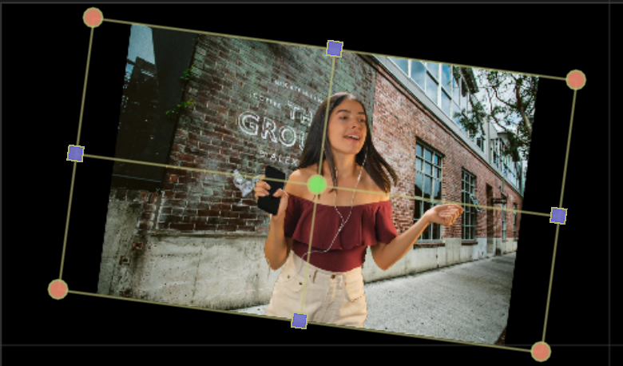
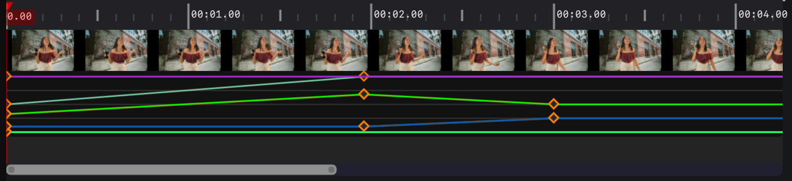
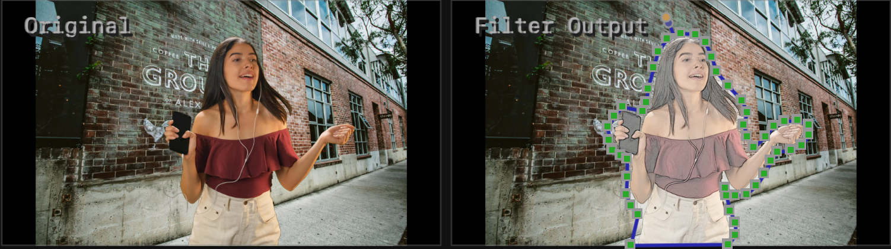
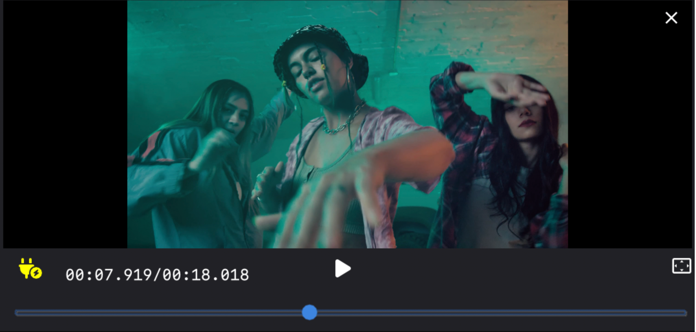
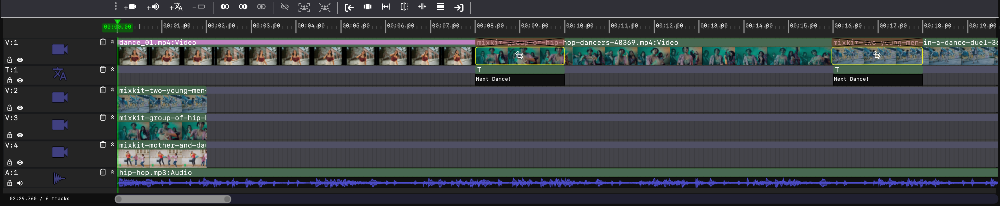
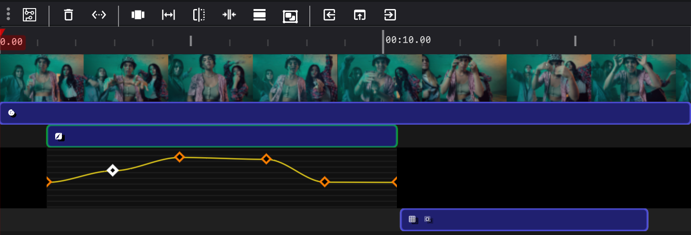

<div align="center">

  # MediaEditor Community

  A lightweight, cross-platform and open-source software for non-linear editing.<br>
  <sub>Available for Linux, macOS and Windows.</sub>

  <a href="LICENSE"></a>
  <a href="https://github.com/opencodewin/MediaEditor/releases/tag/v0.9.9"></a>
  <a href="https://github.com/opencodewin/MediaEditor/pulls"></a>
  <a href="#HOW-TO-CONTRIBUTE"></a>
  <a href="https://github.com/opencodewin/MediaEditor/commits/master"></a>

  [**Use it now →**](docs/dev/Quick-Start.md)
  <br>

  

</div>

## NEWS
#### ***Note:*** For ease of reading, we'll abbreviate <u>***MediaEditor Community***</u> to <u>***Mec***</u>.

<div>
<a href="https://github.com/opencodewin/MediaEditor/releases/tag/v0.9.9"></a>

<h3>&nbsp;&nbsp;🎉🎉🎉&nbsp; Released on February 28, 2024.</h3>

  - <h4>【New 🔥】Graphic operation mode for video attribute editing.</h4>
  >>> <table><tr>
  >>> <td width="55%"></td>
  >>> <td><ul style="list-style-type: circle">
  >>> <li>Support Scaling</li>
  >>> <li>Support Cropping</li>
  >>> <li>Support Moving</li>
  >>> <li>Support Rotating</li>
  >>> </ul></td>
  >>> </tr></table>
  - <h4>【New 🔥】Multi-dimensional Joint Key-Frame mode for video attribute editing.</h4>
  >>> 
  >>> <table><tr>
  >>> <td width="55%"><ul style="list-style-type: circle">
  >>> <li>Support Key-Frame for Scale</li>
  >>> <li>Support Key-Frame for Crop</li>
  >>> <li>Support Key-Frame for Position</li>
  >>> </ul></td>
  >>> <td><ul style="list-style-type: circle">
  >>> <li>Support Key-Frame for Rotate</li>
  >>> <li>Support Key-Frame for Opacity</li>
  >>> </ul></td>
  >>> </tr></table>
  - <h4>【New 🔥】Mask mode for video filter editing.</h4>
  >>> 
  >>> <table><tr>
  >>> <td width="55%"><ul style="list-style-type: circle">
  >>> <li>Support drawing the outline of Mask</li>
  >>> <li>Support Moving Mask or Points on Mask</li>
  >>> <li>Support Deleting Points on Mask</li>
  >>> <li>Support Adding Points on Mask</li>
  >>> </ul></td>
  >>> <td><ul style="list-style-type: circle">
  >>> <li>Support Feathering for Mask</li>
  >>> <li>Support Dilatation for Mask</li>
  >>> <li>Support Corrosion for Mask</li>
  >>> <li>Support Key-Frame Curve for Mask</li>
  >>> </ul></td>
  >>> </tr></table>
  - <h4>【New 🔥】Some new features for Media Bank and Embedded File-Browser.</h4>
  >>> 
  >>> <table><tr>
  >>> <td width="55%"><ul style="list-style-type: circle">
  >>> <li>Support Media Preview from Media Bank and Embedded File-Browser</li>
  >>> <li>Support Media Management, including Searching, Sorting, and Classification</li>
  >>> <li>Support Loading Media from Embedded File-Browser to Timeline</li>
  >>> </ul></td>
  >>> </tr></table>
  - <h4>【New 🔥】Some new features for Timeline.</h4>
  >>> 
  >>> <table><tr>
  >>> <td width="55%"><ul style="list-style-type: circle">
  >>> <li>Add toolbar for timeline</li>
  >>> <li>Refine magnetic snapping, support cropped clip, overlapped clip, and based clip</li>
  >>> </ul></td>
  >>> </tr></table>
  - <h4>【New 🔥】Some new features for Events.</h4>
  >>> 
  >>> <table><tr>
  >>> <td width="55%"><ul style="list-style-type: circle">
  >>> <li>Support Multi-filters mode for Event</li>
  >>> <li>Add toolbar for clip timeline</li>
  >>> <li>Add graphic event list for filter Editing</li>
  >>> </ul></td>
  >>> </tr></table>
  - 💡 Optimized software performance at Media Output by implementing hardware support.
  - 💡 Fixed a lot of bugs.
---
</div><br>

<div>
<a href="https://github.com/opencodewin/MediaEditor/releases/tag/v0.9.8"></a>
<details>
<summary><b>&nbsp;&nbsp;👏👏👏&nbsp; Released on August 28, 2023.</b></summary>

  - **【New 🔥】Supported BluePrint-based event mode.**
  - **【New 🔥】Supported Short-Term filters or effects.**
  - 💡 Optimized software performance at Timeline Preview.
  - 💡 Refined some unreasonable behaviors at UI Level.
  - 💡 Added some fliters and transitions.
  - 💡 Fixed some bugs.
</details>
</div><br>

<div>
<a href="https://github.com/opencodewin/MediaEditor/releases/tag/v0.9.7"></a>
<details>
<summary><b>&nbsp;&nbsp;👏👏👏&nbsp; Released on May 19, 2023.</b></summary>

  - **【New 🔥】Supported plug-in mode for Enhanced clip editing.**
  - 💡 Added some effects and transitions.
  - 💡 Fixed some known bugs.
</details>
</div><br>

<div>
<a href="https://github.com/opencodewin/MediaEditor/releases/tag/v0.9.6"></a>
<details>
<summary><b>&nbsp;&nbsp;👏👏👏&nbsp; Released on April 20, 2023.</b></summary>

  - **【New 🔥】Building the basic framework for non-linear editing.**
  - 💡 Added some UI components.

</details>
</div>

## FUTURE WORK
<table width="700">
<tr>
<td width="100">AI Repair</td>
<td width="160">&#9997; Denoising<br/>&#9997; Deband<br/>&#9997; Inpaint<br/>&#9997; Defocusing<br/>&#9997; Deflicker</td>
<td rowspan=3>

</td>
</tr>
<tr>
<td>AI Enhance</td>
<td>&#9997; Interpolation<br/>&#9997; Super Resolution<br/>&#9997; Face Enhancement</td>
</tr>
<tr>
<td>AIGC</td>
<td>&#9997; Text2Img<br/>&#9997; Img2Img<br/>&#9997; Text2Audio<br/>&#9997; Speech2Text</td>
</tr>
</table>

## FEATURES
* Support complete timeline editing functions, including move, crop, cut, thumbnail preview, scale and delete.
* Support more flexible and easily blueprint system. Blueprint is represented in the form of nodes, which can handle complex functions through nodes and flows.
>>> 
* Support about 45+ built-in media filters and 70+ built-in media transitions.
>>> 
* Support about 10 video and audio analysis tools.
>>> <table><tr><td></td><td></td><td></td></tr></table>
* Support multiple audio and video codecs, including ProRes, H.264, H.265, VP9, etc.
* Support import and edit videos from standard definition to 4K resolution.
* Support magnetic snapping, which can smoothly adjust adjacent clips when arranging them to eliminate gaps, conflicts, and synchronization issues.
* Support frame-by-frame preview mode, including forward playback and reverse playback.
* Support multi-monitor mode, making it easy to preview and process media through external monitors.
* Support video attribute-editing, including cropping, moving, scaling and rotating video frames.
>>> 
* Support audio mixing, including mixer, pan, equalizer, gate, limiter and compressor.
>>> 
* Support curve and keypoint, applied in video filter, video transition, audio filter, audio transition, video attribute and text subtitle.
* Support subtitle editing, including font, position, scale, rotate, oytline width, font attribute, alignment, etc.
* Support customized blueprint nodes, allowing for free expansion of filter and transition effects.
* Support multiple professional export formats, including QuickTime, MKV, MP4, Matroska, etc.

## GETTING STARTED
We provide the following release packages for Windows, Linux and macOS.

| System | Stable / Nightly |
| ------ | ---------------- |
| Windows 10 / 11 | <a href="https://github.com/opencodewin/MediaEditor/releases/download/v0.9.9/mec_SDL2_OpenGL3_win-x86_64-0.9.9.exe"></a> |
| Ubuntu 20.04 | <a href="https://github.com/opencodewin/MediaEditor/releases/download/v0.9.9/MEC_SDL2_OpenGL3-ubuntu2004-x86_64-0.9.9.AppImage"></a> |
| Ubuntu 22.04 | <a href="https://github.com/opencodewin/MediaEditor/releases/download/v0.9.9/MEC_SDL2_OpenGL3-ubuntu2204-x86_64-0.9.9.AppImage"></a> |
| MacOS x86 | <a href="https://github.com/opencodewin/MediaEditor/releases/download/v0.9.9/MEC_SDL2_OpenGL3-MacOS-x86_64-0.9.9.dmg"></a> |
| MacOS ARM | <a href="https://github.com/opencodewin/MediaEditor/releases/download/v0.9.9/MEC_SDL2_OpenGL3-MacOS-arm64-0.9.9.dmg"></a> |

In addition, we also provide tutorials for compiling and installing our software from source code, Please go to [here](docs/dev/How-to-Built.md) 🐧.

Until then, there are three things to note.

- ⚠️⚠️⚠️ Vulkan sdk is necessary, please [download](https://vulkan.lunarg.com/sdk/home) and install it.
- ⚠️⚠️⚠️ For linux, please make the AppImage file executable by the following command:
  ``` sh
  chmod +x MEC_SDL2_OpenGL3-linux-x86_64-x.x.x.AppImage
  ``` 
- ⚠️⚠️⚠️ And if you're using linux distros that use fuse3, and miss libfuse.so.2 to run the AppImage file, you can install it by:
  ``` sh
  sudo apt install libfuse2
  ```

## DEPENDENCIES
Mec relies on some of our other projects. If you are interested in how it's built, you can browse through these projects, which we are constantly updating:

*  imgui (https://github.com/opencodewin/imgui.git)
*  blueprintsdk (https://github.com/opencodewin/blueprintsdk.git)
*  mediacore (https://github.com/opencodewin/MediaCore.git)

## HOW TO CONTRIBUTE
Mec is created by ours and we welcome every contribution. At present, it has achieved quite a lot functions, which also means that it is becoming increasingly large. We don't recommend that you add new functions to this current code. If you really need this functions, please contact us.

## PLUGINS
Mec supports plug-in frameworks, which can expand Filters, Transitions, Effects and AI, according to your own needs. Currently, we offer the following built-in plugins:

### FILTERS AND EFFECTS
| | | | | |
|------------------|-----------------|:--------------|:----------------|:---------------|
| ALM Enhancement  | Audio Equalizer | Audio Gain    | Bilateral Blur  | Binary         |
| Box Blur         | Brightness      | Canny Edge    | CAS Sharpen     | Chroma Key     |
| Color Balance    | Color Curve     | Color Invert  | Contrast        | Crop           |
| Deband           | Deinterlace     | Dilation      | Erosion         | Exposure       |
| Flip             | Gamma           | Gaussian Blur | Guided Filter   | HQDN3D Denoise |
| Hue              | Laplacian Edge  | Lut 3D        | SmartDenoise    | Sobel Edge     |
| USM Sharpen      | Vibrance        | WarpAffine    | WarpPerspective | White Balance  |
| Barrel           | Pincushion      | Jitter        | Kuwahara        | Lighting       |
| PixeLate         | RadicalBlur     | SmudgeBlur    | Soul            | Star           |
| Sway             | WaterRipple     | Bilateral     | Glass           | Emboss         |
| CrossHatch       | Sketch          | Audio Aecho   |||
| | | | | |

**Kuwahara**


### TRANSITIONS
| | | | | |
|-----------------|----------------|:-----------------|:-----------------|:------------------|
| Alpha           | AudioFade      | LinearBlur       | BookFlip         | Bounce            |
| BowTie          | Burn           | BurnOut          | ButterflyWave    | CannabisLeaf      |
| CircleBlur      | CircleCrop     | ColorPhase       | ColorDistance    | CrazyParametric   |
| Crosshatch      | CrossWarp      | CrossZoom        | **Cube**         | DirectionalScaled |
| DirectionalWarp | Dissolve       | DoomScreen       | Door             | Doorway           |
| Dreamy          | DreamyZoom     | Edge             | Fade             | Flyeye            |
| GlitchDisplace  | GlitchMemories | GridFlip         | **Heart**        | Hexagonalize      |
| KaleidoScope    | Luma           | LuminanceMelt    | Morph            | Mosaic            |
| Move            | MultiplyBlend  | PageCurl         | Perlin           | Pinwheel          |
| Pixelize        | Polar          | PolkaDots        | Radial           | RandomSquares     |
| Rectangle       | Ripple         | Rolls            | RotateScale      | RotateScaleVanish |
| SimpleZoom      | SimpleZoomOut  | Slider           | SquaresWire      | Squeeze           |
| StaticWipe      | StereoViewer   | Swap             | Swirl            | WaterDrop         |
| Wind            | WindowBlinds   | WindowSlice      | Wipe             | ZoomInCircles     |
| | | | | |

**Cube**


**Heart**


## LICENSE
Mec is **[LGPLv3 licensed](LICENSE)**. You may use, distribute and copy it under the license terms.

<a href="https://github.com/opencodewin/MediaEditor/graphs/contributors"></a>
