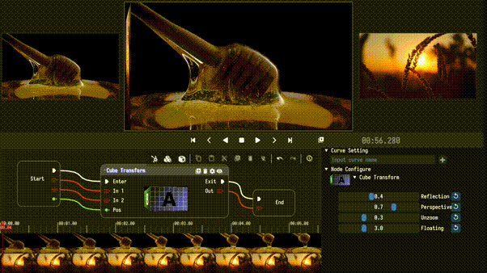

<h1 align="center">MediaEditor Community</h1>

  A simple and elegant open-source media editor that focused on convenience and usability. 
  Available for Linux, macOS and Windows.

 

  
  
  
  
  

 

<h2 align="center">⭐️ Welcome to MediaEditor Community Software! ⭐️</h2>

MediaEditor Community(MEC) is a highly integrated and easy to learn application software that can be used to **create, edit, and produce** high-quality videos. The functions involve **video editing, video filters, video fusion, audio mixing, and text processing**.🌼

## FEATURES
* Support complete timeline editing functions, including move, crop, cut, thumbnail preview, scale and delete.
  &emsp;
* Support more flexible and easily blueprint system. Blueprint💫 is represented in the form of nodes, which can handle complex functions through nodes and flows.
  &emsp;
* Support about 30+ built-in media filters and 60+ built-in media fusions🤖.
  &emsp;
* Support about 10 video and audio analysis tools🍂.

  &emsp;🍂Video CIE&emsp;&emsp;&emsp;&emsp;&emsp;&emsp;&emsp;&emsp;🍂Video Waveform&emsp;&emsp;&emsp;&emsp;&emsp;🍂Audio Spectrogram

  &emsp;

* Lightweight, cross platform, high-performance software, support Linux, Mac, and Windows.
* Support multiple audio and video codecs, including ProRes, H.264, H.265, VP9, etc.
* Support import and edit videos from standard definition to 4K resolution.
* Support magnetic snapping, which can smoothly adjust adjacent clips when arranging them to eliminate gaps, conflicts, and synchronization issues.
* Support frame-by-frame preview mode, including forward playback and reverse playback.
* Support multi-viewpoint mode, making it easy to preview and process media through multiple displays.
* Support video attribute-editing, including cropping, moving, scaling and rotating video frames.
* Support audio mixing, including mixer, pan, equalizer, gate, limiter and compressor.
* Support curve and keypoint, applied in video filter, video fusion, audio filter, audio fusion, video attribute and text subtitle.
* Support subtitle editing, including font, position, scale, rotate, oytline width, font attribute, alignment, etc.
* Support customized blueprint nodes, allowing for free expansion of filter and fusion effects.
* Support multiple professional export formats, including QuickTime, MKV, MP4, Matroska, etc.

## GETTING STARTED
MEC's developers work hard to make it support a large range of devices and operating systems. We provide final as well as development builds. To get started, head over to the **[downloads page💠](https://github.com/opencodewin/MediaEditor/releases)** and simply select the platform that you want to install it on. A **[quick guide📝](docs/dev/Quick-Start.md)** to help you get acquainted with MEC is available in our docs.

## SCREENSHOT
|
Video Filter
|
Video Fusion
|
|---|---|
|||

|
Audio Mixing
|
Media Output
|
|---|---|
|||

## DEPENDENCIES
Although installers are much easier to use, if you must build from 
source, here are some tips: 

MEC needs some relevant submodules to be compiled to run. So, 
be sure you have the following submodules in order to run MEC successfully: 

*  imgui (https://github.com/opencodewin/imgui.git)
*  blueprintsdk (https://github.com/opencodewin/blueprintsdk.git)
*  mediacore (https://github.com/opencodewin/MediaCore.git)

## HOW TO BUILD
MEC uses CMake as its building system but instructions are highly dependent on your operating system and target platform. **[Building from source🐙](docs/dev/How-to-Built.md)**.

## HOW TO CONTRIBUTE
MEC is created by users for users and **we welcome every contribution**. There are no highly paid developers or poorly paid support personnel on the phones ready to take your call. There are only users who have seen a problem and done their best to fix it. This means MEC will always need the contributions of users like you.

## LICENSE
MEC is **[LGPLv3 licensed](LICENSE)**. You may use, distribute and copy it under the license terms.

