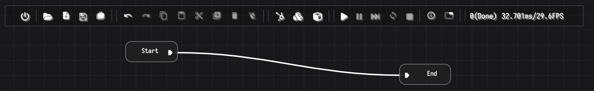
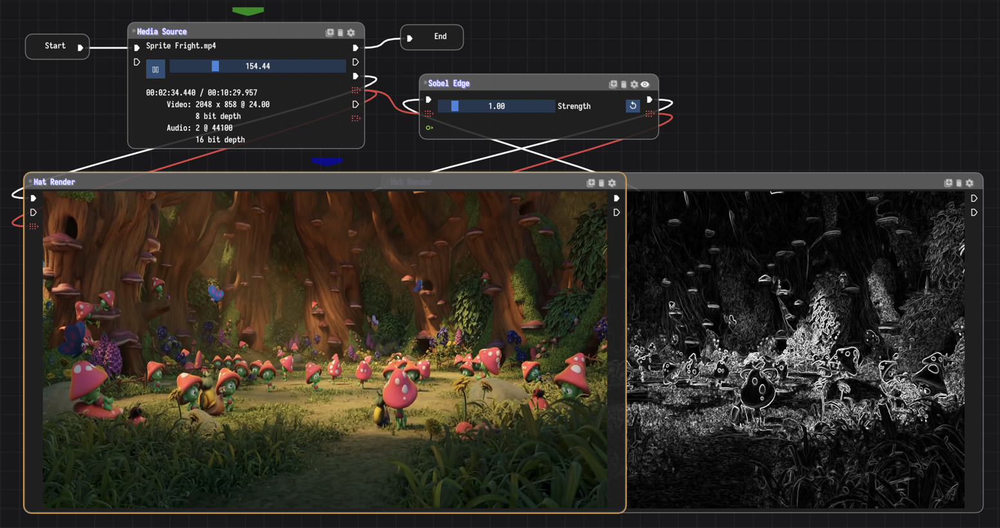
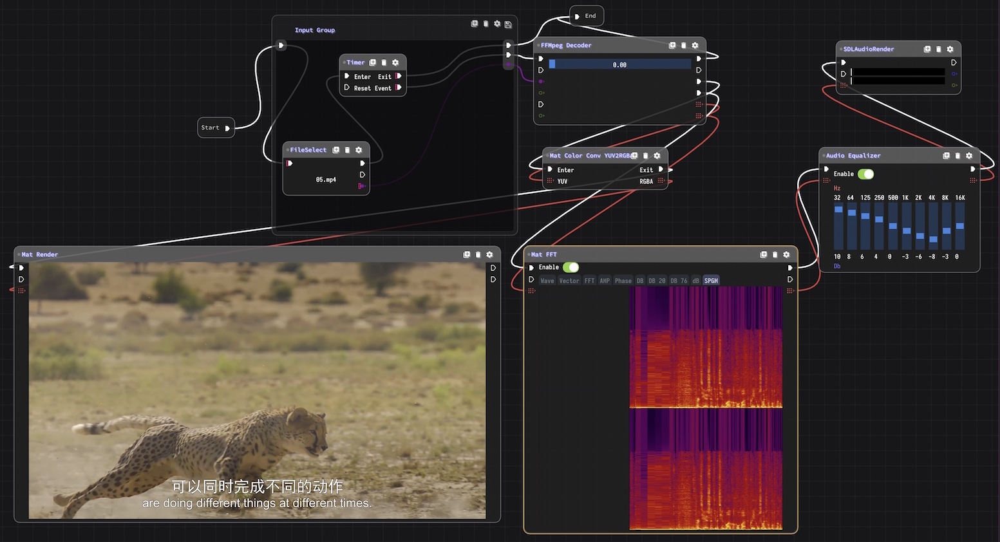

<h1>BluePrintSDK</h1>

BluePrintSDK is the core of Media filters and transitions in **[MediaEditor](https://github.com/opencodewin/MediaEditor.git)**. Blueprint is a form composed of **multiple nodes** that can **handle complex functions** through the flows between nodes. Node is the basic unit in the blueprint, it's a function module.

## INTRODUCTION

When you first use the BluePrintSDK, in its editing area, you can have a hard time understanding how a node somehow connects to communicate with anpother node. But by observing, you quickly discover that:

* There are three types of nodes: Start node, Functional node, and End node.
* Functional nodes have pins on the left and right sides. Start node and End node have pins only on one side.
* Pins and connections have different colors and icons;
* Connection mode is from the right side of the previous node to the left side of the next node.

Actually, node‘s pins is divided into process pin and data pin:
* Process pin indicates the overall flow direction, which is shown as the node is triggered by who and triggered nodes, process pin can be triggered by multiple nodes.
* Data pin indicates that data is available. It can be provided for use by multiple nodes, but can only accept data from a single node. Data pins have data types, such as mat, float, int, etc.

## SCREENSHOT
|
Demo 1
|
|---|
||

|
Demo 2
|
|---|
||

|
Demo 3
|
|---|
||

## LICENSE
BluePrintSDK is **[LGPLv3 licensed](LICENSE)**. You may use, distribute and copy it under the license terms.
