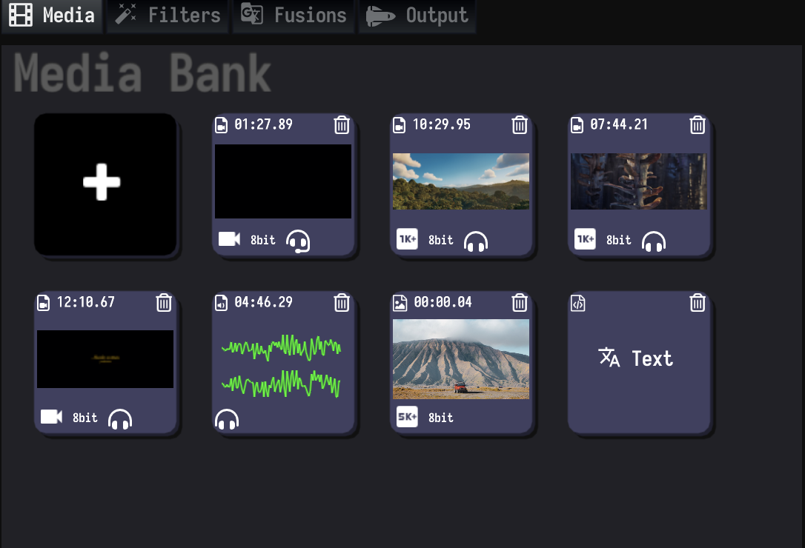

## Using the Media Editor Community.
Some steps in the process are not necessarily necessary, and others may need to be added as well. Also, the workflow is not necessarily linear. For example, you can import more media files for your project after you have completed the editing and effects.

### Step 1: Prepare your media files
To use the Media Editor, you need to transfer your media files (video, audio, and images) from the recording device to your local workstation or an external storage device.

<h1 align="center">

<h1>

### Step 2: Organize the media
The Media Editor manages media materials through the media library. In the Media Editor, your media footage is usually presented as thumbnails, allowing you to easily preview video media quickly, and these thumbnails will essentially link to media files on your local storage device.

<h1 align="center">

<h1>

### Step 3: Create the project and add the fragment to it
You can use the media files in the media library to build new projects. By adding the media snippet to the timeline, you are ready to start creating your video. All editing takes place in the project; The original media file remains unchanged (this is called non-destructive editing).

<h1 align="center">

<h1>

### Step 4: Arrange and edit the fragments
Now your video is really starting to take shape. To arrange rough cuts, rearrange and trim the segments in the timeline. You can also use auditions to try out different pieces. Add cutting shots, subtitles, background music, and sound effects to the project using the clips and storylines used to connect.

### Step 5: Add special effects and transitions
Select the desired effect from the large selection of effects in the Media Editor. Use Transitions to transition multiple segments and provide subtitles and credits for the video.
To further polish your project, use precision editing to fine-tune cuts and transitions, keyframes for video and audio effects to apply effect curves, and color correction is especially critical.

### Step 6: Export your movie
You can export video files that meet your requirements or select some videos to export for effect check.