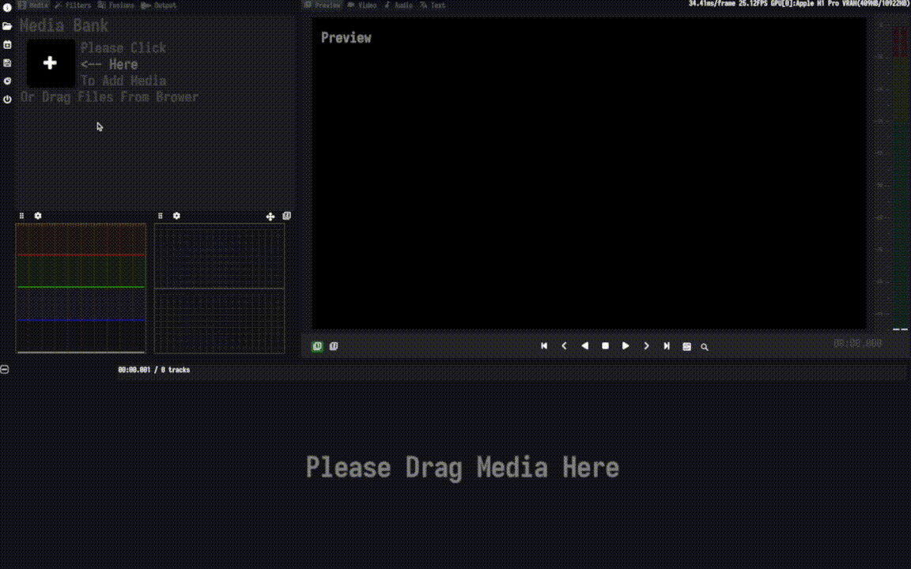
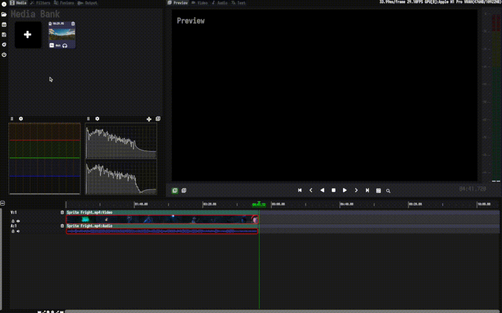
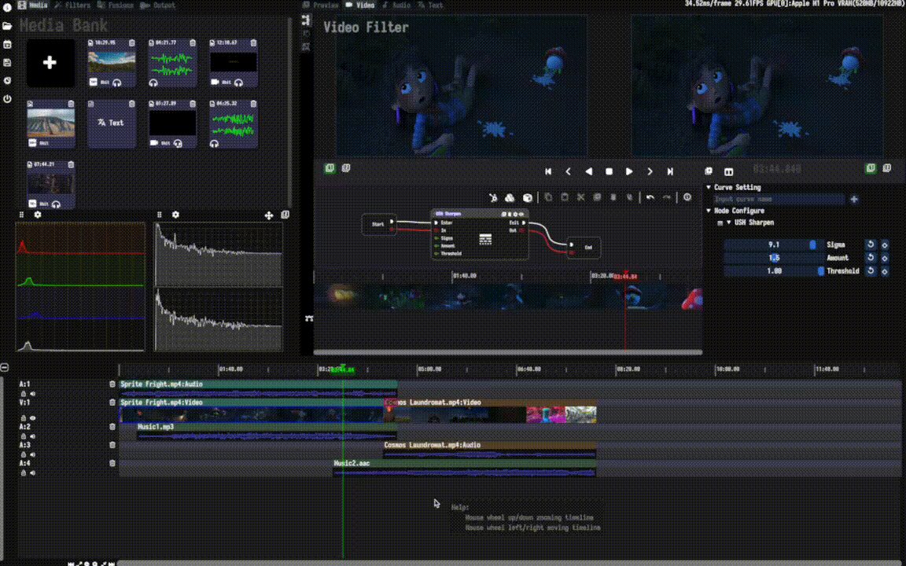

# QuickStart for MediaEditor Community
## Downloads
#### We provide the following release packages for Windows, Linux and macOS.

| System | Stable / Nightly |
| ------ | ---------------- |
| Windows 10 / 11 |  |
| Ubuntu 20.04 |  |
| Ubuntu 22.04 |  |
| MacOS x86 |  |
| MacOS ARM |  |

## Tutorials
#### ***Note: <u>This Tutorial will be rewritten in the near future.</u>***
#### ***Note: <u>The software is still in development, this tutorial maybe has quite different from the actual situation.</u>***
#### This tutorial contains the following contents for quickly understand and use MediaEditor Community: 
- [Create a project](#create-a-project)
- [Add clip to timeline](#add-clip-to-timeline)
- [Play clips in the media thumbnail](#play-clips-in-the-media-thumbnail)
- [Create first rough-cut](#create-first-rough-cut)
- [Add music](#add-music)
- [Add more materials](#add-more-materials)
- [Rearrange clips](#rearrange-clips)
- [Pruning by time](#pruning-by-time)
- [Sound mixing](#sound-mixing)
- [Add Transitions](#add-transitions)
- [Add Filters](#add-filters)
- [Output sample](#output-sample)

---
### Create a project
1. Click "New Project" in the system sidebar, and Media Editor will pop up a built-in file browser;
2. Switch the directory to "/Users/fans/Projects" in the file browser;
3. Fill "Project1" in the text input box at the bottom of the file browser;
4. Click "OK" to create project.

---
### Add clip to timeline
1. Click "Add new media in bank" in the media bank to open the file browser;
2. Switch the directory to "/Users/fans/Resources" in the file browser;
3. Select the "Sprite Right.mp4" file;
4. Click "OK" to add a material to the media bank;
5. Move the mouse to the video material named "Sprite Right" in the media bank and hold down the left button, then drag the file to the timeline area. Release the left button when the yellow outline appears on the timeline edge;
6. The video clip named "Sprite Right" has been added to the timeline. At this time, there are two tracks on the timeline, the video track V1 and the audio track A1. Each track corresponds to a clip of the same type as the track.

---
### Play clips in the media thumbnail
1. To View frame, click the left button on the scale-line area of the timeline to switch the time point;
2. To play preview, click "Play" in the media thumbnail to play the video;
3. To Quick preview, drag the green ruler-line in the scale-line area of the timeline to preview the video quickly.

---
### Create first rough-cut
1. Trim the video clip named "Sprite Fright", reducing the header to about 04:30.00, precision is not required. The purpose of pruning is to preserve the indentation, which can be adjusted later. Do the same with the audio clip in the video;
2. Move the video clip named "Sprite Fright" on the track V1 to the scale-line 00:00.00. Do the same with the audio clip in the video;
3. Cut the end part of the video clip named "Sprite Fright", which contains the producer information, at around 04:40.00. Do the same with the audio clip in the video.

---
### Add music
1. Click "Add new media in bank" in the media bank to open the file browser;
2. In the file browser, switch to "/Users/fans/Sources".
3. Select the "Music1.mp3" file.
4. Click "OK" to add the audio material to the media bank;
5. Move the mouse pointer to "Music1" in the media bank and hold down the left button. Drag the segment to the timeline area and release the left button when the yellow outline appears at the edge of the timeline;
6. The audio track A2 appears in the timeline, on which is an audio clip called "Music1";
7. Align the tail of the audio clip named "Music1" on the tail of a video clip named "Sprite Fright" through magnetic alignment.

---
### Add more materials
1. Open File Explorer (or Finder) and go to "/Users/fans/Sources".
2. Select multiple audio and video files, including "Cosmos Laundromat.mp4", "Music2.aac", etc.;
3. Drag all files to the media bank and release the left button. All materials are added to the media bank.

---
### Rearrange clips
1. Add the video clip named "Cosmos Laundromat" to video track V2 and audio track A3 of the timeline;
2. Cut the video clip named "Cosmos Laundromat" at around 06:40.00 and 10:15.00 respectively. No precision is required. Do the same with the audio clip in the video;
3. Move the track V2 to the top of the timeline and align the header of the video clip named "Cosmos Laundromat" and the tail of the video clip named "Sprite Fright" by magnetic alignment;
4. Add the audio clip "Music2", which is on audio track A4, to the timeline.

---
### Pruning by time
1. Scale the timeline until 08:00.00 appears in the scale-line area and align the end of the video clip named "Cosmos Laundromat" to 08:00.00;
2. Check the overlapping area between the header of the video clip named "Cosmos Laundromat" and the tail of the video clip named "Sprite Fright" to see if there is scene switching in the header of the video clip named "Cosmos Laundromat". If so, Delete a few towing frames in the header of the video clip named "Cosmos Laundromat";
3. Align the end of the audio clip "Music2" to 08:00.00;
4. Move the video clip named "Cosmos Laundromat" from the track V2 to the track V1 to form a overlapping area while keeping the tail of the video clip named "Cosmos Laundromat" aligned until 08:00.00.

---
### Sound mixing
1. Double-click any audio clip thumbnail on the timeline to enter the audio filter-editing page and then switch to the audio mixing-editing page;
2. Adjust the sound intensity of the audio A1, A2, A3 and A4, reduce the volume of A1 and A3, and slightly increase the volume of A2 and A4;
3. Change the layout of the audio PAN so that the sound is biased towards the front-channel output;
4. Adjust the equalizer to make the audio output more vivid.

---
### Add Transitions
1. Press SHIFT and double-click the title area of the video clip overlapping area to enter the video transition-editing page;
2. Introduce a transition from the transition bank, as select "LuminanceMelt Transform", and then connect the flow-pin and the data-pin to make the transition node effective;
3. Click "Play" to preview the transition after using "LuminanceMelt Transform" for the overlapping clip.

---
### Add Filters
1. Double-click the thumbnail of the video clip named "Sprite Fright" to enter the video filter-editing page;
2. Introduce a filter from the filter bank, as select "USM Sharpen", and connect the flow-pin and the data-pin to make the filter node effective;
3. Change the "Sigma" parameters of the USM Sharpen node, and check the filter of different parameters in the preview window;
4. Until the picture is clear, the degree of sharpening is moderate, and there is no visual deviation.

---
### Output sample
1. At around 01:00.00 before the overlapping area, set "Add mark in" through the scale-area of the timeline;
2. At around 01:00.00 after the overlapping area, set "Add mark out" through the scale-area of the timeline;
3. Switch the media bank page to the media output page;
4. Set The output name is "sample1", and the output path is "/Users/fans/Tests";
5. The sample can be outputed without setting audio and Video encodc by directly click "Make Video";
6. Select "Encoding in mark range" and click "Start encoding";
7. Wait for the output progress bar to reach 100% to output the full sample;
8. You can view the content of file "sample1.mp4" through the video player in the "/Users/fans/Tests" path.

