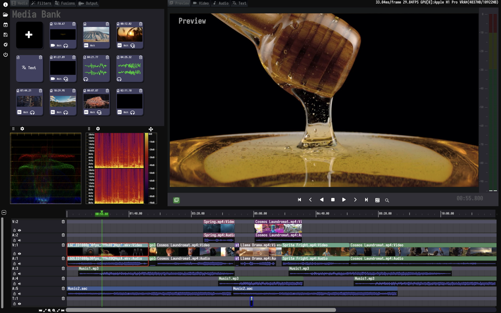

.. MediaEditor documentation master file, created by
   sphinx-quickstart on Wed Mar  1 10:53:00 2023.
   You can adapt this file completely to your liking, but it should at least
   contain the root `toctree` directive.

MediaEditor Community
========================================================================

About
-----

MediaEditor Community(MEC) is a **free and open source** software for media editing. Available as a native application for **Linux, macOS and Windows operating systems**, MEC runs on most common processor architectures.

The latest source code is available at `GitHub <https://github.com/opencodewin/MediaEditor>`_. 

Download
--------

Executables can be downloaded from https://github.com/opencodewin/MediaEditor/releases/.

Getting Started
---------------
1. Download the `pre-built binaries <https://github.com/opencodewin/MediaEditor/releases>`_ or build the
   library manually from `source <https://github.com/opencodewin/MediaEditor>`_
   (see :ref:`Installation <installation>`).
2. Use cmake tools to easily build models with a single click (see :ref:`Quickstart <quick-start>`).

Acknowledgments
---------------

The Software was written by `opencodewin <https://github.com/opencodewin/>`_.
If you want more customization functions, please contact us through the email address under this account.

.. toctree::
   :hidden:
   :maxdepth: 2

   install
   quickstart
   gui